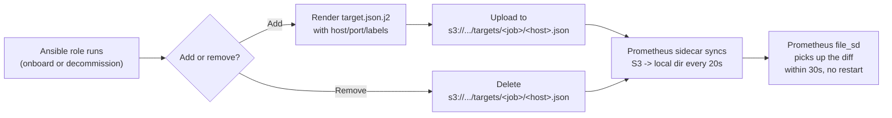
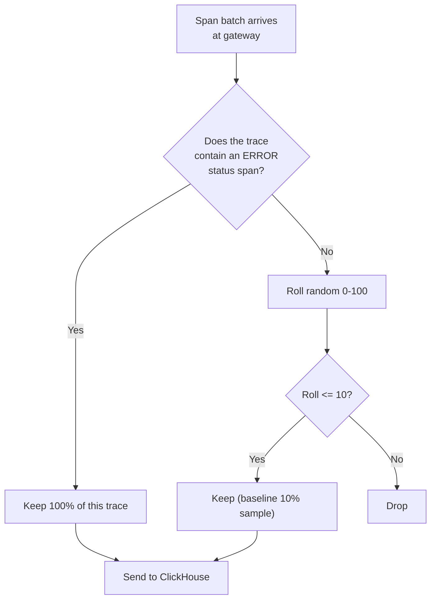
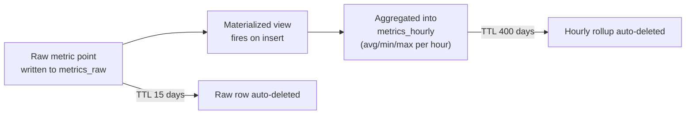
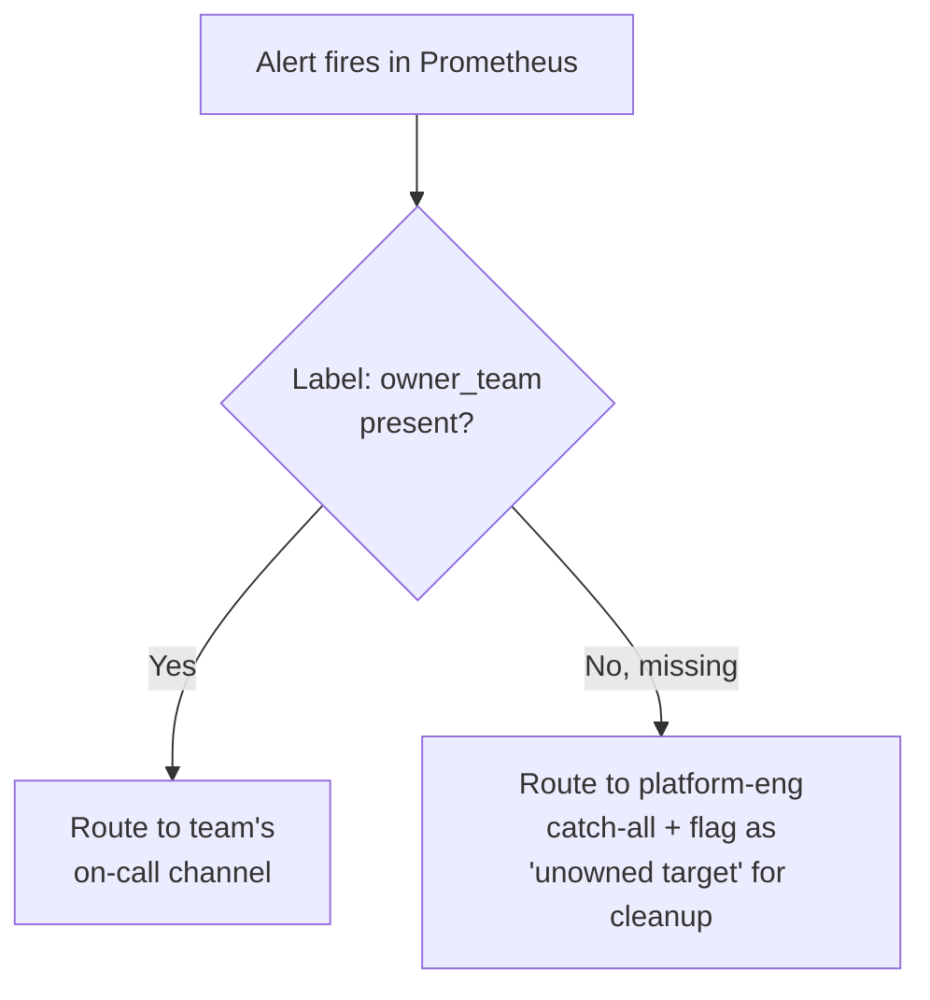

# Algorithms & Decision Flows

This doc explains the *logic* behind key automated decisions in the platform — written for engineers who are new to the system and need to understand not just "what runs" but "why it decides what it decides."

## 1. Target registration algorithm (add/remove mechanism)

The core trick that makes onboarding/offboarding safe and fast: **Prometheus never reads a live inventory system directly — it only watches a folder of small JSON files.** Everything else in the platform exists to keep that folder correct.



**Why this design, not a database or Consul?** At this scale, a folder of files is easier to reason about, diff, audit (S3 versioning), and back up than a service that itself needs monitoring. It also treats AWS and non-AWS targets identically — there's no special case for "EC2 vs. everything else."

## 2. ClickHouse shard/replica placement algorithm

When Terraform provisions `shard_count × replica_count` ClickHouse nodes, it decides which AZ each node lands in using simple round-robin, implemented as:

```
for shard in 0..shard_count:
  for replica in 0..replica_count:
    node_index = shard * replica_count + replica
    az = availability_zones[node_index % number_of_azs]
```

**Why round-robin, not "pack shard 1 into AZ-a"?** If you naively pack all replicas of a shard into consecutive AZ slots, a single AZ outage can take out multiple *different* shards' single AZ-local replica simultaneously, if replica_count ≥ az_count in the wrong pattern. Round-robin distribution across the flattened list spreads both shards and their replicas evenly, so no single AZ failure removes more than one replica from any given shard (as long as `replica_count ≤ az_count`, which is enforced as a design constraint — see `terraform/modules/clickhouse-cluster/variables.tf`).

## 3. Trace sampling algorithm (OTel Gateway `tail_sampling` processor)



**Why tail sampling, not head sampling?** Head sampling (deciding at trace start) can't know whether a trace will end in an error — you'd either keep 100% of everything (expensive) or randomly miss the error traces you actually care about. Tail sampling waits until the whole trace is assembled, then always keeps errors and only randomly drops the "boring" successful traces. Trade-off: it needs slightly more memory/buffering at the gateway, which is why gateway `memory_limiter` and autoscaling exist.

## 4. Retention/downsampling algorithm (metrics)



Queries for "last 24 hours" hit `metrics_raw` (full resolution). Queries for "last quarter" hit `metrics_hourly` (already aggregated, far fewer rows to scan). Grafana dashboards should pick the table based on the query's time range — see dashboard query examples in `kubernetes/grafana/values.yaml` datasource config for the convention.

## 5. Rolling deployment safety algorithm (Ansible `serial`)

| Target group | `serial` value | Why |
|---|---|---|
| `keeper_nodes` | `1` | Quorum-based system — touching more than 1 of 3 nodes at once risks losing quorum majority mid-change. |
| `clickhouse_nodes` (site.yml) | `34%` (~1 of 3 replicas) | Keeps at least 1 replica per shard live during routine config convergence. |
| `clickhouse_nodes` (clickhouse_cluster.yml, topology changes) | `1` | Topology changes are higher-risk than routine config — maximum caution, always wait for `/ping` before continuing. |
| `monitored_vms` | `25%` | Stateless agents — losing several simultaneously briefly reduces monitoring coverage but causes no data loss; batching for speed is an acceptable trade-off here. |

**The general principle**: `serial` value is inversely proportional to blast radius. The more a mistake in this group could cascade (lose quorum, lose all replicas of a shard), the smaller the batch size — down to `1` for anything quorum-based.

## 6. Alert routing (conceptual — configure in Grafana Alerting / Alertmanager)



This is why `owner_team` is a required field in the onboarding script — an unlabeled target's alerts fall through to a catch-all that nobody is specifically watching closely, so unowned alerts get systematically deprioritized versus owned ones. Always set it correctly at onboarding time.
