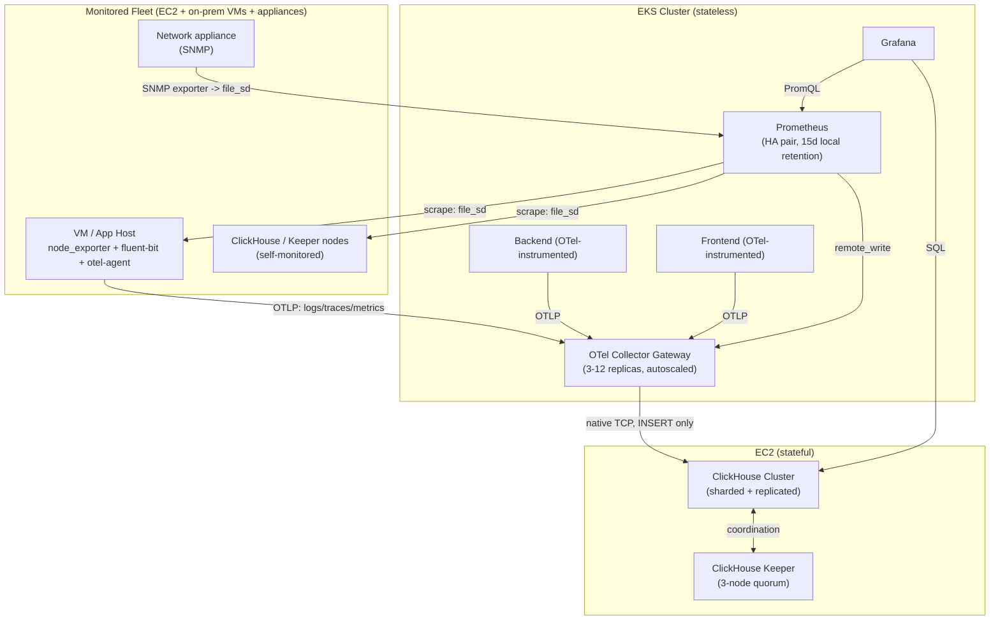
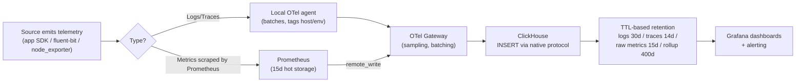

# Architecture

## 1. System overview

This platform ingests **metrics, logs, and traces** from a 100+ host fleet spread across two AWS regions, stores them in a clustered ClickHouse database, and visualizes them in Grafana. Prometheus handles real-time scraping/alerting; ClickHouse is the long-term/high-cardinality store for logs and traces (and a downsampled long-term store for metrics).

## 2. Why this shape

| Decision | Rationale |
|---|---|
| ClickHouse on EC2, not EKS | Predictable local NVMe/EBS I/O, no CSI/StatefulSet edge cases at 100+ host ingestion volume, simpler capacity planning per node. |
| Everything else on EKS | Stateless — scale with HPA, redeploy freely, no special care needed. |
| OTel Gateway is the only ClickHouse writer | One choke point for credentials, backpressure, sampling. Simplifies security review to a single component. |
| Prometheus **and** ClickHouse both store metrics | Prometheus = real-time alerting (seconds-level freshness, 15d window). ClickHouse = long-term, high-cardinality historical analysis (400d downsampled). Different tools for different access patterns — don't try to make one do both. |
| file_sd (S3-backed) for target registration | Uniform mechanism for AWS and non-AWS targets. Prometheus reloads automatically — no restart on add/remove. |
| Multi-region (us-east-1 + eu-west-1) | eu-west-1 is a warm DR standby — smaller footprint, same replication factor, promoted manually per `DISASTER_RECOVERY.md`. |

## 3. Data lifecycle

## 4. Component responsibility matrix

| Component | Owns | Does NOT own |
|---|---|---|
| Fluent Bit | Tailing/parsing log files on hosts | Long-term storage, alerting |
| OTel Agent (per-host) | Local batching + tagging, forwarding to gateway | Sampling decisions (gateway does this), storage |
| OTel Gateway | Sampling, batching, the *only* ClickHouse write path | Scraping, alerting rules |
| Prometheus | Scraping, short-term storage, alert evaluation | Long-term storage, log/trace storage |
| ClickHouse | Long-term storage for logs/traces/metrics, high-cardinality queries | Alert evaluation, scraping |
| Grafana | Visualization, dashboards, alert routing UI | Data storage |
| Ansible | Host-level config, target lifecycle (add/remove) | Cloud resource provisioning |
| Terraform | AWS resource provisioning (VPC, EKS, EC2, IAM) | In-instance configuration |

## 5. Network/security boundaries

- ClickHouse and Keeper live in **isolated database subnets** — no direct internet route, reachable only from EKS node SG and within the SG itself (replication/coordination traffic).
- The ALB is the only public entrypoint; it terminates TLS and routes by hostname to Grafana or the frontend service.
- SSH to ClickHouse/Keeper nodes is restricted to the VPC CIDR only — operational access goes through a bastion/SSM Session Manager, not public SSH.
- ClickHouse enforces write/read separation at the user level (`otel_writer` = INSERT only, `grafana_reader` = SELECT only, both password-hashed, no `access_management`).

See `docs/diagrams/` for source Mermaid files if you need to edit/export these diagrams individually.
