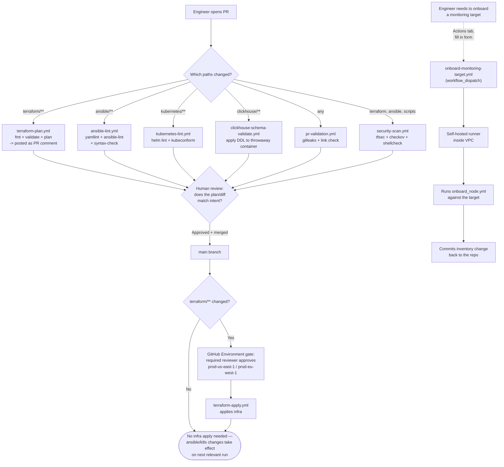

# CI/CD — GitHub Actions

## Workflow inventory

| Workflow | Trigger | Purpose |
|---|---|---|
| `terraform-plan.yml` | PR touching `terraform/**` | `fmt`/`validate`/`plan` for both regions, posts plan as PR comment |
| `terraform-apply.yml` | Push to `main` (or manual) | Applies infra — gated by GitHub Environment required-reviewer rules |
| `ansible-lint.yml` | PR touching `ansible/**` | `yamllint`, `ansible-lint`, syntax-check every playbook |
| `kubernetes-lint.yml` | PR touching `kubernetes/**` | `helm lint` on all values files, `kubeconform` on raw manifests |
| `clickhouse-schema-validate.yml` | PR touching `clickhouse/**` | Applies every DDL file against a throwaway ClickHouse container |
| `security-scan.yml` | PR + weekly schedule | `tfsec`, `checkov`, `shellcheck` |
| `pr-validation.yml` | Every PR | Secret scanning (gitleaks), link check, PR description requirement |
| `onboard-monitoring-target.yml` | Manual (`workflow_dispatch`) | Self-service onboarding — no shell access to the control node needed |
| `decommission-monitoring-target.yml` | Manual (`workflow_dispatch`) | Self-service removal, requires typed hostname confirmation |
| `scheduled-fleet-convergence.yml` | Nightly cron | Idempotent drift correction across the whole fleet |

## Pipeline flow

## Required setup before these workflows will run

1. **AWS OIDC role** for `terraform-plan.yml` / `terraform-apply.yml` — create an IAM role trusting GitHub's OIDC provider, scoped to the minimum permissions needed to plan/apply this Terraform. Store the role ARN as `AWS_TERRAFORM_ROLE_ARN` (and `_EUW1` variant) in repo secrets. Do **not** use long-lived AWS access keys.
2. **GitHub Environments** — create `prod-us-east-1`, `prod-eu-west-1`, and `fleet-management` environments under repo Settings → Environments, each with required reviewers configured. This is what actually enforces "someone has to approve this apply/onboard/decommission" — the workflow YAML alone doesn't gate anything without this.
3. **Self-hosted runner inside the VPC** — GitHub-hosted runners can't reach hosts in private subnets. Register a runner (small EC2 instance in a private subnet, or an existing bastion) with the label `observability-vpc`. This runner needs the SSH key and AWS credentials needed to run Ansible against the fleet.
4. **Secrets** — `FLEET_SSH_PRIVATE_KEY`, `ACM_CERT_ARN` (+ `_EUW1`), `INTERNAL_ZONE_ID` (+ `_EUW1`), `SLACK_WEBHOOK_URL`. Store all of these in the relevant GitHub Environment's secrets, not repo-level secrets, so environment approval also gates secret access.
5. **`GITHUB_TOKEN` write permission** — the onboard/decommission workflows commit back to the repo (updating `monitored_targets.yml`). Confirm Settings → Actions → Workflow permissions is set to "Read and write."

## Design notes for junior engineers

- **Why plan-on-PR but apply-on-merge, not apply-on-PR?** Applying infrastructure changes should never happen against unreviewed code. The plan is what reviewers look at; the apply only runs after a human has approved both the code diff *and* (via the Environment gate) the specific apply action.
- **Why self-hosted runners only for the fleet-touching workflows?** Lint/validate/plan workflows don't need to reach private infrastructure — they run fine on GitHub-hosted runners, which is simpler and requires no runner maintenance. Only the workflows that actually SSH into hosts (onboard, decommission, nightly convergence) need the VPC-local runner.
- **Why does decommission require typing the hostname twice?** `workflow_dispatch` forms don't have a native "type to confirm" pattern like some UIs do. Requiring the same value in two separate fields is a cheap guard against selecting the wrong entry from memory or fat-fingering a hostname.
- **Why is `terraform-apply.yml` two independent jobs, not one job with a matrix?** The two regions use different AWS credentials/roles and different Environment approval gates. Keeping them as separate jobs means eu-west-1 can be approved and applied independently of us-east-1 — a matrix job would couple their approval flow together.
