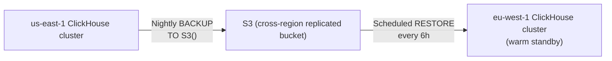

# Disaster Recovery

## Regions

- **us-east-1** — primary, full-size cluster (3 shards × 2 replicas ClickHouse, 3-node Keeper).
- **eu-west-1** — warm standby, smaller footprint (2 shards × 2 replicas), same Keeper quorum size. Not actively serving production traffic under normal conditions.

## Cross-region data strategy

ClickHouse `ReplicatedMergeTree` replication (via Keeper) operates **within** a region only — Keeper quorums don't span the WAN latency between us-east-1 and eu-west-1. Cross-region durability instead uses:

1. **Scheduled `BACKUP` to S3** (cross-region-replicated bucket) from the primary cluster — run nightly via a cron-triggered Ansible play (extend `clickhouse_cluster.yml` with a `backup.yml` play using ClickHouse's native `BACKUP ... TO S3(...)` command).
2. **eu-west-1 restores from the latest S3 backup** on a schedule (e.g. every 6 hours) rather than live-replicating — this is the deliberate trade-off of a **warm** (not hot) standby: RPO of a few hours, not zero, in exchange for far simpler operations than cross-region Keeper quorums.

If your organization needs a lower RPO, the alternative is synchronous cross-region replication via a stretched Keeper quorum — significantly more operationally complex and latency-sensitive; only take this on if the few-hours RPO above is genuinely insufficient for your compliance/business requirements.

## Failover procedure (region-level)

1. Confirm us-east-1 is actually down (not a transient issue) — check EKS cluster health, ClickHouse `/ping` across all shards, and AWS Health Dashboard for us-east-1.
2. Update DNS/ALB routing (Route53 failover routing policy, pre-configured) to point traffic at the eu-west-1 ALB.
3. Scale up eu-west-1 EKS node groups and ClickHouse shard count to full production size if the standby was intentionally kept small (`terraform apply` with updated `desired_size`/`shard_count` in `environments/prod-eu-west-1`).
4. Confirm the latest S3 backup restore completed successfully before declaring eu-west-1 "live" — check restore job logs, don't assume.
5. Communicate the RPO gap to stakeholders: any data ingested in us-east-1 between the last successful backup and the outage is not yet in eu-west-1.
6. Once us-east-1 recovers, treat it as the new standby (or fail back deliberately, during a maintenance window, not automatically) — never let both regions think they're primary simultaneously.

## Node-level recovery (single ClickHouse/Keeper node lost, region otherwise healthy)

1. Terraform will show the lost instance as needing recreation on next `plan` (if it was terminated outside of Terraform, e.g. hardware failure) — review the plan carefully, it should show only that one node.
2. `terraform apply` to recreate the instance (same shard/replica tags, same EBS-backed data volume if the volume itself survived — if the EBS volume was also lost, this is effectively a fresh replica).
3. Run `ansible/playbooks/clickhouse_cluster.yml` — ClickHouse's replication will automatically backfill the new/empty replica from its surviving peer(s) once it registers with Keeper. No manual data copy needed for a *replica* replacement (this is the point of `ReplicatedMergeTree`).
4. Monitor `system.replication_queue` on the new node until it's empty — that's your signal the backfill is complete.
5. For a Keeper node: confirm quorum health (`mntr` command) before AND after the replacement — never proceed with other cluster changes while the Keeper quorum is degraded.

## What is NOT covered by this DR plan

- **EKS/Grafana/Prometheus** are stateless-ish (Prometheus has 15d local retention that would be lost on a full region loss, but that data also exists — sampled and downsampled — in ClickHouse). Recovering these is just redeploying Helm charts in the standby region; no special data recovery needed.
- **In-flight data at the moment of failure** (the gap between last backup and outage) is genuinely lost for the primary path; this is the accepted trade-off of the warm-standby model. If this is unacceptable for your use case, escalate to redesign toward synchronous replication rather than trying to patch around it.
