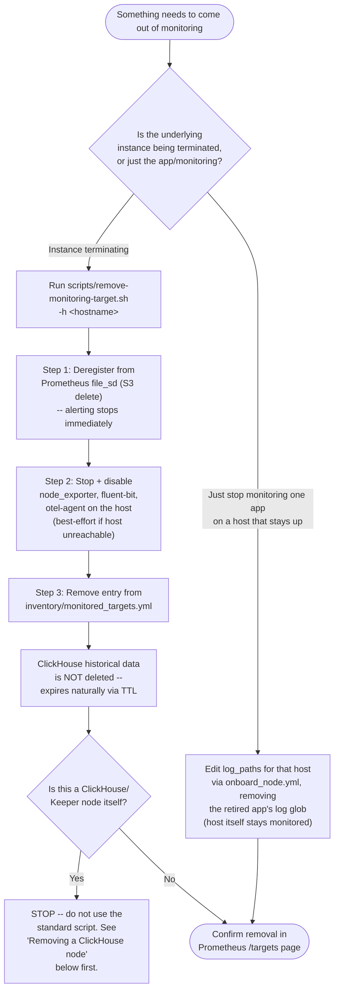

# Offboarding Runbook — Removing a Host / App / Image / Appliance from Monitoring

## Golden rule

**Deregister from alerting BEFORE tearing anything down.** If you stop the agents first, Prometheus will see the target go "down" and fire a page for a host that's being intentionally decommissioned — a classic false-alarm-at-2am mistake. The tooling here enforces the correct order automatically; don't work around it by SSHing in and killing services manually.

## Decision flowchart



## Path A: Standard removal (VM being terminated)

```bash
./scripts/remove-monitoring-target.sh -h web-app-07
```

1. **Deregister first.** The playbook deletes the S3 `file_sd` object before touching the host. Prometheus stops scraping (and thus stops alerting on) this target within its next refresh cycle (~30s) — before agents even start shutting down.
2. **Stop agents.** `node_exporter`, `fluent-bit`, `otel-agent` are stopped and disabled. This step uses `ignore_unreachable: true` — if the instance is already terminated, this is skipped gracefully rather than failing the whole run.
3. **Clean inventory.** The host's block is removed from `inventory/monitored_targets.yml`.
4. **Data retention is untouched.** Nothing in this flow deletes ClickHouse data. Logs/traces/metrics already ingested continue to exist until their TTL expires (30d / 14d / 15d+400d respectively — see `docs/ARCHITECTURE.md` § 2). This is intentional: a mistaken decommission is always recoverable by re-onboarding, and post-incident investigations often need logs from a host that's since been terminated.

## Path B: Removing one app from a host that stays monitored

Don't run the full decommission — that removes the whole host. Instead, re-run onboarding with the retired app's log path excluded:

```bash
ansible-playbook ansible/playbooks/onboard_node.yml \
  -e "hostname=web-app-07" -e "target_host=10.0.40.55" \
  -e "owner_team=checkout-squad" \
  -e "log_paths=['/var/log/checkout/*.log']"   # dropped the retired app's glob
```

## Path C: Removing a ClickHouse or Keeper node — special care required

**This is the highest-risk operation in the whole repo. Do not use `remove-monitoring-target.sh` for this.**

1. Confirm the shard/replica you're removing still has at least one other healthy replica for its shard (`SELECT * FROM system.replicas WHERE table = 'logs_local'`). Never drop the last replica of a shard without first migrating its data.
2. If replicas remain healthy: `terraform apply` with the reduced `replica_count`/`shard_count` — Terraform will show a `-` (destroy) on exactly the node(s) being removed. Confirm the plan lists ONLY the intended node before applying.
3. Run `ansible/playbooks/clickhouse_cluster.yml` afterward to re-render `remote_servers.xml` on all *remaining* nodes so they stop trying to reach the removed one.
4. Never remove a Keeper node without checking quorum health first (`clickhouse-keeper-client` `mntr` command) — removing a node from a 3-node quorum drops you to 2, which has **no** fault tolerance until a replacement joins.
5. See `docs/DISASTER_RECOVERY.md` for the full node-replacement procedure, including how to safely re-balance data after a shard is removed.

## Path D: Appliance / SNMP target removal

Since these are registered manually (see `ONBOARDING_RUNBOOK.md` Path C), removal is also manual:
1. Delete the `file_sd` JSON from `s3://acme-observability-file-sd/targets/appliance/<name>.json`.
2. Remove the `snmp_exporter` target config entry.
3. Remove the entry from `monitored_appliances` in `inventory/monitored_targets.yml` (PR).
4. Revoke the appliance's Vault credential path if no longer needed elsewhere.

## Post-removal checklist

- [ ] Target no longer appears in Prometheus `/targets`
- [ ] No active alerts reference the removed host/appliance
- [ ] `inventory/monitored_targets.yml` no longer lists it (check via `git diff`, this should be a clean removal, not a partial edit)
- [ ] Owning team notified (especially if this was requested by someone other than the owner)
