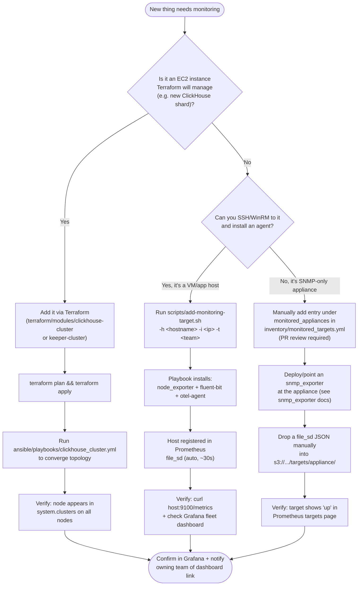

# Onboarding Runbook — Adding a Host / App / Image / Appliance to Monitoring

Read this before adding **anything** to the monitored fleet. It applies to:
- a new **VM** (EC2 instance or on-prem)
- a new **application** deployed on an already-monitored VM (just new log paths)
- a new **image/appliance** (golden AMI, vendor appliance, SNMP-only device)

## Decision flowchart — which path do I take?



## Path A: Standard VM / application host

**This is the common case — 95% of onboarding requests.**

```bash
./scripts/add-monitoring-target.sh \
  -h web-app-07 \
  -i 10.0.40.55 \
  -t checkout-squad \
  -p "/var/log/checkout/*.log"
```

What happens, step by step:

1. **Inventory write** — `inventory/monitored_targets.yml` gets a new entry under `monitored_vms`. This is committed via the automation, but if you're doing this by hand instead of the script, open a PR — never edit this file outside of a reviewed change.
2. **Agent install** (`ansible/playbooks/onboard_node.yml` runs `common`, `node_exporter`, `fluentbit`, `otel_collector` roles):
   - `node_exporter` starts on port 9100 (host metrics)
   - `fluent-bit` starts tailing the log paths you specified, forwards to the local OTel agent
   - `otel-agent` starts, forwards everything to the central gateway
3. **Prometheus registration** — a `file_sd` JSON target definition is written to S3. Prometheus polls this every 30s; no restart needed.
4. **Verification** — the playbook itself checks `node_exporter` is reachable and returns 200 before reporting success. Don't consider the host onboarded until you see this confirmation.
5. **Confirm in Grafana** — open the fleet overview dashboard, filter by hostname, confirm data is flowing (allow ~2 minutes for the first data points to land in ClickHouse via the gateway pipeline).

### Adding a new application to an *already-monitored* host

You don't need the full onboarding flow — just add the new log path:

```bash
ansible-playbook ansible/playbooks/onboard_node.yml \
  -e "hostname=web-app-07" -e "target_host=10.0.40.55" \
  -e "owner_team=checkout-squad" \
  -e "log_paths=['/var/log/checkout/*.log','/var/log/new-service/*.log']"
```
This is idempotent — re-running with an updated `log_paths` list just adds the new Fluent Bit input, it won't duplicate the host registration.

## Path B: New ClickHouse/Keeper capacity (Terraform-managed)

Only for platform-team members expanding cluster capacity, not for onboarding application monitoring targets.

1. Edit `terraform/environments/prod-<region>/main.tf` — bump `shard_count` or `replica_count` in the `clickhouse_cluster` module block (or `node_count` for `keeper_cluster`).
2. `terraform plan` — confirm you see only **additions**, not replacements. If you see a `-/+` on existing nodes, stop and read `docs/DISASTER_RECOVERY.md` first.
3. `terraform apply`.
4. Run `ansible-playbook ansible/playbooks/clickhouse_cluster.yml` — this re-renders `remote_servers.xml` on every node (including existing ones, since the topology changed) and brings up the new node(s) one at a time (`serial: 1`).
5. Verify: `SELECT * FROM system.clusters WHERE cluster = 'obs_cluster'` on any node should list the new shard/replica.

## Path C: SNMP-only appliance (routers, firewalls, load balancers)

These can't run an agent. You need an `snmp_exporter` instance (can run centrally, doesn't need to live on the appliance) configured to poll it, then register that exporter's endpoint as the Prometheus target — not the appliance's own IP.

1. Add appliance credentials to Vault under `secret/observability/snmp/<name>`.
2. Add an entry under `monitored_appliances` in `inventory/monitored_targets.yml` (manual PR — there's no automation script for this path yet; consider contributing one if you do this often).
3. Configure `snmp_exporter`'s target list to include the appliance.
4. Drop a `file_sd` JSON pointing at the `snmp_exporter` endpoint (not the appliance) into `s3://acme-observability-file-sd/targets/appliance/`.
5. Verify in Prometheus's `/targets` page — job `appliance-snmp` should show `up`.

## Path D: Golden image / pre-baked appliance instances

If your image already bakes in the OTel agent + Fluent Bit config at build time (self-registering on boot), you don't run the onboarding playbook per-instance — the image itself calls the registration step on first boot (see your image's cloud-init/user-data script, which should call `prometheus_registration`'s logic directly or hit an internal onboarding API if you've built one).

Track the image in `monitored_images` in `inventory/monitored_targets.yml` for audit purposes even though individual instances self-register — this is where you record "this image type is expected to appear," not individual running instances.

## Common mistakes

- **Skipping verification.** A host with agents installed but never confirmed in Grafana is a host nobody is actually watching — this has bitten teams badly. Always complete the verification step.
- **Hand-editing `monitored_targets.yml` without a PR.** It's the audit trail for "what's being monitored and why." Bypass it and the next person doing an audit has no idea this target exists.
- **Forgetting `owner_team`.** This drives alert routing. An unowned host's alerts go nowhere useful.
